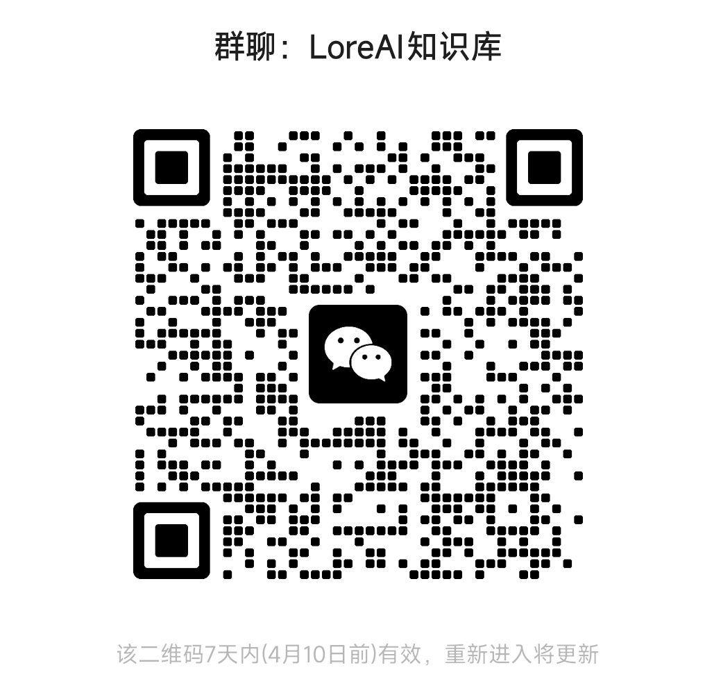

# Lore AI ：大模型时代最佳实践知识库

在 AI 技术飞速发展的时代，传统学习方式已难以跟上知识更新与实际需求的步伐。我们创建Lore AI知识库，旨在为大学生提供一个开放、动态的平台，帮助你快速掌握并应用 AI 最佳实践，获得提升。

##### 目前知识库处于启动阶段，希望能收集更多需求以进行未来的迭代
同时内部的质量相对原始，后续会持续更新，也欢迎大家参与进来一起贡献

---
## 零、为什么需要这个知识库？
- 信息过载：传统方式海量信息质量参差不齐，难以筛选。
- 快速变化：AI 最佳实践不断迭代，传统学习效率低下。
- 实践脱节：理论知识难转化为实际能力。

直接学习最佳实践能快速掌握成功方法，避免试错，高效解决问题，尤其适合快速发展的领域。
特别由于目前大量领域已经依赖人与AI的协作，直接从最佳实践开始意味着简单有效。

## 一、项目简介与愿景

**项目简介**  
知识库希望支持“持续迭代+持续维护”的理念，聚焦两个核心领域：

1. **实际落地**：直接提供被持续维护的最佳实践。基于丰富的落地案例与具体的实践指南，解释如何将理论转化为实际操作，从而优化具体的任务流程。目前计划支持工作，科研，学习等领域。
2. **知识认知信息**：构建AI方面从基础到前沿的全链条知识体系，帮助用户全面理解 AI 时代带来的认知变革，建立良好的知识依赖。真正支持站在时代前沿。

**愿景与目标**

- **愿景**：打造一个不断进化的知识生态，成为跨领域实践与认知升级的知识同步平台。
- **目标**：
    - 提供持续更新、多维度的内容，高效获取最佳实践。
    - 搭建协作平台，一起收集、迭代 AI 认知与实践，共享 AI 带来的便利与效率。

---

## 二、内容结构

### 1. 实际落地
[[落地实践/README]]

这一部分希望将理论知识转化为可操作的实践方案，涵盖多个场景：
- **工作实践**  
    展示 AI 在工作场景中的赋能效果，探讨职业转型、新兴岗位及未来趋势，带来实际工作中的最佳实践，支持工作模式的革新。
- **学习实践**  
    探讨如何利用 AI 提升学习效率和个性化资源获取，以及具体案例和工具应用说明。
- **科研实践**  
    分析如何在科研全流程中借助 AI 优化研究方案、挖掘问题并推动成果转化，着重探讨新问题和新范式。
####  当前目录

[[落地实践/工作-AI产品经理/README]]
如何从零开始成为一个AI产品经理

[[落地实践/工作-大模型工程师+科学家/README]]
工程师和科学家相关的大模型职位及对应的能力学习

[[落地实践/工作-AIGC内容创作者/README]]
将AI应用到内容制作中

[[落地实践/学习-AI通用能力/README]]
如何更深度学习AI的通用能力

### 2. 知识认知信息

这一部分希望实现AI知识储备的完善，建立详细的关联关系，做到真正理解。细分为以下模块：
[[知识信息认知/README]]
- **基本知识**  
    精炼的科普级内容，提供知识的基本框架和结构，类似精简的知识点级别对照表，方便快速入门和对照。
- **详细知识**  
    类似综述性教科书的系统讲解，构成学科核心和应用细节，适合深入系统地学习。
- **前沿知识**  
    聚焦最新的学术动态、技术产品及创新趋势，确保用户始终站在时代前沿。

- **核心认知**  
    汇聚顶尖专家的观点与共识，通过多角度认知对比激发对根本问题的深度思考。

- **重点信息**  
    针对热点、创新、学术活动和投融资等领域，整合多渠道信息，带来新的高质量信息，帮助认知的持续迭代。

---

## 三、使用指南

不同人有不同需求，所以不必按部就班地从最基础开始。这里的重点是：根据你当前遇到的问题或目标，灵活地找到最适合的内容，直接对接最佳实践。

- **目标导向，解决问题**  
    当你碰到具体问题或有明确目标时，可以直接查找相关的实践指南或核心认知内容。边实践边补充所需知识，比从头学起更高效。
    
- **按需取材，灵活学习**  
    如果发现某个领域的知识还不够，可以有选择地浏览“基本知识”、“详细知识”或“前沿知识”中和你当前需求相关的内容，快速填补空白，而不必重头开始。
    
- **定制个性路线**  
    有经验的朋友可以直接关注“科研实践”或“工作实践”模块，获取与你任务相关的案例；而如果遇到问题，就从需要的知识点入手。这样既省时间，也更贴近实际。
    
- **持续互动，随时调整**  
    使用过程中随时分享你的体验和疑问，平台也会不断更新优化内容。这样大家都能找到最适合自己情况的学习路线。
    

总之，这里鼓励大家根据自己当前的目标和需求，自由选择学习路径，把时间和精力花在真正对你有帮助的地方！

---

## 四、优势对比与保障机制

### 优势对比

- **动态更新 vs 静态教材**  
    与依赖固定教材和线性传授的传统学习方式不同，本知识库通过持续迭代更新，确保内容始终与最新动态接轨。
- **理论与实践结合 vs 单一理论传授**  
    除了系统性理论介绍，知识库更加注重落地实践与案例验证，让你在实际操作中不断检验和深化所学知识。
- **多维视角 vs 单一学科视角**  
    汇聚论文、行业分享、专家观点及外网翻译等多元信息，形成跨领域、全景式的知识生态，帮助你应对复杂多变的实际应用场景。
- **更低成本 vs 传统投入模式**  
    通过按需学习和精准匹配资源，降低无谓投入，实现整体学习和实践成本的有效控制。
- **按需学习 vs 难度与价值曲线不平滑**  
    希望借助按需学习的方式，实现更平滑的难度曲线和价值曲线，让每个阶段都能最大化收益。

### 保障机制

- **持续迭代更新**  
    定期整合高质量外部内容与最新研究成果，确保知识库内容始终保持前沿性。
- **专家审核与用户反馈**  
    通过专家审核和开放的用户互动渠道，双重保障内容的权威性与实用性。
- **多源数据融合**  
    利用论文、行业报告、优质翻译和 LLM 自动生成等多种数据源，实现信息的交叉验证和深度提炼。
- **检索与生成机制**  
    借助先进的检索生成技术，支持实时搜索和定制化内容输出，满足不同场景下的精准需求。

---

## 五、贡献指南

我们热忱欢迎对 AI 应用、领域知识及实践案例有独到见解的你参与共建。贡献方式包括：

- **内容投稿**：提交原创案例、理论解析、翻译优质文献等；
- **互动讨论**：参与平台讨论，反馈使用体验，共同完善内容体系；
- **数据共享**：提供实践数据与验证案例，助力不断优化知识库结构。

### 欢迎加入知识库群，欢迎反馈，更多交流会帮助我们做得更好

---

知识库希望打破传统单向学习的局限，构建一个动态、开放且高效的知识生态系统。通过持续迭代更新、多维视角整合和多重保障机制，期待与大家共同推动理论与实践的深度融合，携手迎接 AI 时代带来的无限可能与挑战。

希望在使用过程中，你能不断探索、反馈并积极参与共建，让这个知识库成为我们共同成长与创新的坚实后盾。

---