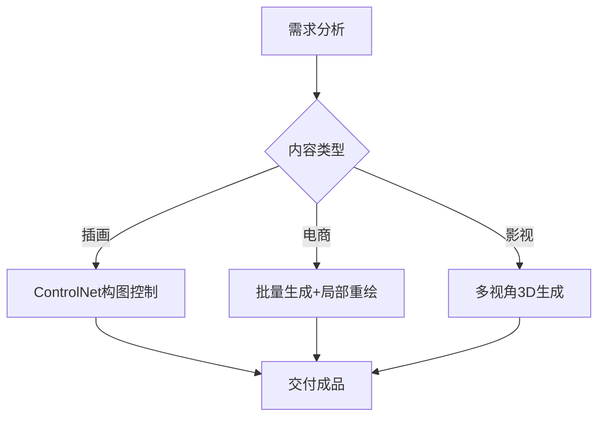

# Stable Diffusion 系统化学习计划

## 学习目标
通过 **8-12 周** 分阶段学习，掌握从基础操作到商业应用的全流程技能，实现：
- ✅ 本地/云端环境部署
- ✅ 精准控图与参数优化
- ✅ 定制化模型训练
- ✅ 商业化合规应用

---

## 阶段一：基础入门（1-2 周）
### 🎯 核心目标：环境搭建与基础功能实践

### 1. 环境搭建
- **本地部署**：使用秋葉aaaki的整合包（一键安装，避免复杂配置），推荐选择包含 ControlNet 和常用插件的版本。
- **硬件要求**：
  - 最低配置：GTX 1060 6GB / 16GB RAM
  - 推荐配置：RTX 3060 12GB / 32GB RAM
- **云端替代方案**：  
  [DreamStudio](https://dreamstudio.ai/) | [Google Colab Pro](https://colab.research.google.com/)

### 2. 基础功能实践
- **文生图（Text-to-Image）**：
  - 输入简单提示词（如 ```1girl, masterpiece, detailed eyes```），观察生成效果。
  - 调整基础参数：采样步数（20-30）、CFG Scale（7-11）、分辨率（512x768）。

- **图生图（Image-to-Image）**：
  - 上传参考图，调整 ```Denoising Strength（0.3-0.7）```控制修改幅度。

### 3. 资源导航
- 模型下载：
  - 访问 Civitai（免费模型社区）和 Hugging Face，优先下载高评分 Checkpoint 模型（如 ```revAnimated_v11```）。
  - 避免使用过大的模型（>7GB），防止显存不足。


---

## 阶段二：进阶应用（3-6 周）
### 🎯 核心目标：精准控制与效率优化

### 1. 参数深度解析
```python
# 典型参数组合（WebUI）
{
  "sampler": "DPM++ 2M Karras",
  "steps": 30,
  "hires_scale": 2,
  "hires_steps": 15,
  "denoising_strength": 0.6
}
```
- **采样器对比**：

| **特性**         | **Euler a**                                  | **DPM++ 2M**                                 | **UniPC**                                    |
|------------------|---------------------------------------------|---------------------------------------------|---------------------------------------------|
| **算法类型**      | 随机采样器（祖先采样）                      | 确定性多步二阶求解器                        | 确定性预测-校正器                           |
| **收敛性**        | ❌ 不收敛（持续注入随机噪声）                | ✅ 强收敛（步数>30时稳定）                   | ⚠️ 部分收敛（步数>15时较好）                |
| **生成速度**      | ⚡ 单步最快，但需更多步数（20-40步）         | 🕒 中等速度（推荐20-30步）                   | 🚀 低步数极快（10-15步可达高质量）           |
| **图像质量**      | 🎨 中等（随机噪声增加多样性）                | 🖼️ 高细节（适合写实风格）                    | 🌟 高效高质量（低步数清晰，高步数更精细）     |
| **随机性**        | 高（适合创意生成）                          | 低（结果可复现）                            | 低（结果可复现）                            |
| **推荐步数**      | 20-40步                                     | 20-30步（建议启用Karras噪声表）             | 10-25步（细节需求高可增至30步）             |
| **适用场景**      | 艺术创作、风格探索                          | 商业设计、写实渲染                          | 快速测试、移动端/低配置设备                 |
| **优势**          | 简单快速，多样性丰富                        | 平衡速度与质量，稳定性强                    | 超低步数高效，兼容性强                      |
| **局限性**        | 结果不可重复，细节可能不协调                | 步数过低时细节不足                          | 极低步数可能有残留噪声                      |

- **高清修复（Hires Fix）**：结合 ```Latent``` 放大算法与 ```Denoising Strength（0.5-0.7）```，提升分辨率至 2K 以上.

### 2. 插件与模型生态应用
- **必装插件清单**：
  - ControlNet（构图控制）
  - ADetailer（自动面部修复）
  - Dynamic Prompts（批量生成）
  - Tagger（图片反推提示词）
- **模型分类管理**：
  - Checkpoint（主模型）：存放于 ```models/Stable-diffusion```，切换不同风格（如写实、二次元）。
  - LoRA/Embedding：微调特定元素（如角色特征、画风），存放于对应子目录。

### 3. 提示词工程
- **结构化模板**：
```markdown
[质量词] + [主体描述] + [风格] + [艺术家] + [细节强化]  
示例：  
`(best quality), 1girl in cyberpunk city, anime style by Ilya Kuvshinov, (intricate mechanical details:1.2)`
```
- **权重控制**：
  - 使用 ```(word:1.3) ```增强关键词，```[word]``` 降低干扰元素影响
- **负面提示词库**：
  - 加载 ```EasyNegative``` 等 Embedding 模型，避免畸形手、低画质问题。
---

## 阶段三：实战精通（6-12 周）
### 🎯 核心目标：商业化落地与定制化开发

### 1. 项目实战
- **艺术创作**：结合 ControlNet 的 ```canny```（线稿控制）和 ```depth```（景深控制），生成风格化插画或场景设计。
- **商业设计**：批量生成电商模特图（换装/背景替换），使用 ```Inpaint``` 局部重绘优化细节

### 2. 商业应用场景


### 3. 模型训练指南
- **模型微调**

| 训练类型 | 数据要求        | 硬件需求      | 工具推荐        |
|----------|-----------------|---------------|-----------------|
| LoRA     | 10-20 张同风格  | RTX 3060 12GB | Kohya_SS        |
| Dreambooth | 30-50 张多角度 | RTX 3090 24GB | Diffusers 库    |

- **模型融合**：混合多个 Checkpoint 模型（如写实+动漫），生成独特画风，注意避免冗余数据

### 4. 商业化合规要点
- ✅ 使用合规训练数据（CC0/自有版权）
- ✅ 企业年收入 >100 万美元需购买商业授权
- ❌ 禁止生成真人肖像/商标元素

### 5. 效率工具链
- 使用 ComfyUI 搭建自动化工作流，集成 GPT 生成提示词，提升产出效率。

---

## 学习资源导航
### 🔗 关键资源链接
| 类型         | 名称                     | 链接                                                                 |
|--------------|--------------------------|----------------------------------------------------------------------|
| 整合包       | 秋葉aaaki一键安装包      | [B站教程](https://www.bilibili.com/video/BV1kc411b7xm)               |
| 模型社区     | Civitai                  | [https://civitai.com](https://civitai.com)                           |
| 进阶课程     | Nenly系统教学            | [B站合集](https://www.bilibili.com/video/BV1As4y127HW)               |
| 官方文档     | Stable Diffusion Wiki    | [GitHub](https://github.com/AUTOMATIC1111/stable-diffusion-webui/wiki) |

---

## 注意事项
⚠️ **硬件安全**  
- 监控 GPU 温度（推荐使用 [GPU-Z](https://www.techpowerup.com/gpuz/)）
- 连续生成不超过 2 小时  

⚠️ **版权风险**  
- 商用前使用 [Hive Moderation](https://hivemoderation.com/) 检测违规内容

> 提示：建议加入 [Stable Diffusion 中文社区](https://discord.gg/xxxxxx) 获取实时技术支持
```

