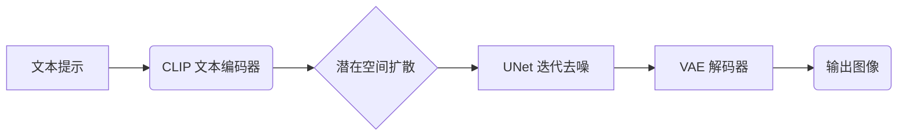

Stable Diffusion 是由 **Stability AI**、**CompVis** 和 **LAION** 联合开发的开源 AI 图像生成模型（2022 年发布）。基于潜在扩散模型（Latent Diffusion Model），支持文本生成图像、图像修复、超分辨率重建等核心功能。

---

## 核心功能与亮点

### 1. 多任务生成能力
- **文生图 (Text-to-Image)**  
  输入提示词生成图像（例："哥特小镇夜景，高对比度，数字艺术风格"）
- **图生图 (Image-to-Image)**  
  实现风格迁移/图像变体生成
- **超分辨率与修复**  
  支持 4x/8x 分辨率提升
- **3D 内容生成**  
  配合扩展工具生成多视角 3D 视频（如 Stable Virtual Camera）

### 2. 高度定制化
- **ControlNet 功能**（v3.5+）  
  通过控制模块精准调节生成效果：
  - `blur`（模糊控制）
  - `canny`（边缘检测）
  - `depth`（深度图）
- **参数调节**  
  支持分辨率（最高 16K）、迭代步数（30-50 步）、种子值等设置

### 3. 开源与免费使用
- 代码/模型权重全开源
- 本地部署需 GPU（推荐 RTX 3060+）
- 网页版 [DreamStudio](https://dreamstudio.ai/) 提供免费基础服务

---

## 技术原理

1. **文本编码**：CLIP 模型将文本转为语义向量
2. **潜在扩散**：在低维空间进行噪声迭代消除（比传统扩散模型快 5-10 倍）
3. **图像解码**：VAE 模型将潜在向量还原为像素图像

---

## 应用场景
- **艺术创作**：插画/油画/摄影风格生成
- **商业设计**：海报/Logo/AI 模特生成
- **影视游戏**：分镜设计/3D 资产纹理生成

---

## 版权声明
- 遵循 **OpenRAIL-M 许可证**
- 用户生成内容可商用（企业年收入 >100 万美元需购买商业授权）
- 禁止生成违法/侵权内容
